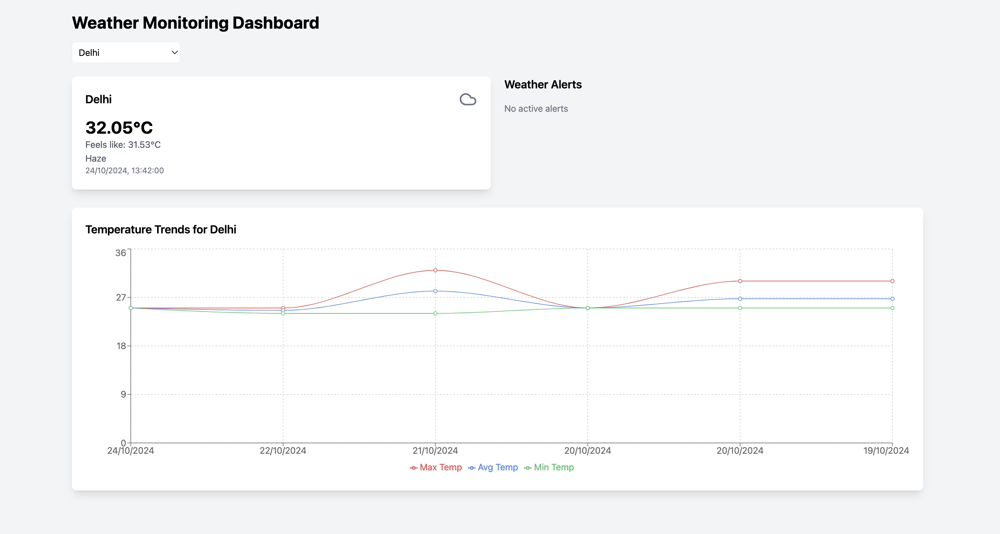

# Real-Time Weather Data Processing System

This system is designed to continuously monitor weather conditions for various metros in India using the OpenWeatherMap API. It processes the real-time weather data, provides daily weather summaries using rollups and aggregates, and triggers alerts based on user-defined thresholds.

## Features

- **Real-time weather monitoring** for six Indian metros: Delhi, Mumbai, Chennai, Bangalore, Kolkata, and Hyderabad.
- **Weather data parameters**:
  - `main`: Main weather condition (e.g., Rain, Snow, Clear)
  - `temp`: Current temperature in Celsius
  - `feels_like`: Perceived temperature in Celsius
  - `dt`: Time of the data update (Unix timestamp)
- **Rollups and Aggregates**:
  - Daily summary of average, maximum, and minimum temperatures.
  - Dominant weather condition based on frequency or significance (justified by the weather data trends).
- **Alerting System**:
  - User-configurable thresholds for temperature or specific weather conditions (e.g., alert if the temperature exceeds 35°C for two consecutive updates).
  - Alerts triggered via console or optional notification system.
- **Data Visualization**:
  - Displays historical weather trends, daily summaries, and triggered alerts through visual charts.

 

## Prerequisites

1. **Node.js and npm**: Install Node.js from [here](https://nodejs.org/).
2. **MongoDB**: Set up MongoDB for storing daily weather summaries.
3. **API Key**: Sign up on [OpenWeatherMap](https://openweathermap.org/) to get your free API key.

## Installation

1. Clone this repository:

   ```bash
   git clone https://github.com/Shashank-9680/Rule-engine-assignment.git
   cd Rule-engine-assignment
   ```

2. Install dependencies:
   Backend
   ```bash
   cd backend
   npm install
   npm run dev
   ```
   Frontend
    ```bash
   cd frontend
   npm install
   npm run dev
   ```

## Usage

- **Weather Data Retrieval**: The system will call the OpenWeatherMap API at a configurable interval (default: every 5 minutes) to retrieve weather data for the specified cities.
- **Temperature Conversion**: Temperatures are fetched in Kelvin and converted to Celsius by default.

  Optionally, you can configure user preference for Fahrenheit by adding this to `.env`:

  ```
  TEMP_UNIT=Fahrenheit
  ```

- **Daily Summaries**: The system will store daily summaries of weather data in a MongoDB database. It calculates:
  - Average temperature
  - Maximum and minimum temperatures
  - Dominant weather condition
- **Alerting**: Define user thresholds (e.g., alert if the temperature exceeds 35°C for two consecutive updates). Alerts can be viewed in the console or sent as notifications (expandable).

## Test Cases

1. **System Setup**:

   - Verify system connects to the OpenWeatherMap API and starts successfully using a valid API key.

2. **Data Retrieval**:

   - Simulate weather data retrieval at intervals and verify parsing.

3. **Temperature Conversion**:

   - Test Kelvin to Celsius/Fahrenheit conversion based on user settings.

4. **Daily Weather Summary**:

   - Simulate several days of weather data to ensure correct rollups (average, min, max temperatures, dominant weather condition).

5. **Alerting Thresholds**:
   - Configure thresholds and simulate data exceeding them. Verify that alerts are triggered correctly.

## Future Enhancements

- Add notification system for sending alerts (e.g., email or SMS).
- More robust user management for setting preferences and alerts.
- Expand visualizations to display data trends over longer periods.

## License

This project is licensed under the MIT License.
